

Supported language: 

# Summary
1. [Introduction](#introduction)
   * [Overview](#overview)
   * [Requirements](#requirements)
   * [Showcase](#showcase)
   * [QR Code Samples](#qrcode-examples)
2. [Architecture](#architecture)
   * [Clean Architecture](#clean-architecture)
   * [Design Patterns](#design-patterns)
   * [Quality Assurance](#tests)
   * [Frameworks](#frameworks)
3. [Application Setup](#setup)   
4. [License](#license)

<a name="introduction" />

# Introduction

<a name="overview" />

## Overview
Simplified shopping application

 The requirements raised for this assignment shall test concepts of:
 1. Architectural design for Android Applications;
 2. Ability to communicate with complex end-points, parsing JSON responses and update UI;
 3. Data persistence and database manipulation;
 4. Use Apiary to send transaction, to check documentation click in this [**link**](http://docs.uzias.apiary.io/#reference/0/transactions/create-a-new-transaction)

<a name="requirements" />

<table>
  <tr>
    <td colspan="4" align="center"><b>Requirements</b></td>
  </tr>
  <tr>
  <td align="center"><b>ID</b></td>
  <td align="center"><b>Name</b></td>
  <td align="center"><b>Description</b></td>
  </tr>
  <tr>
    <td>REQ001</td>
    <td align="justify">Get products</td>
    <td align="justify">Application must be able to read an URL and parse url to get products</td>
  </tr>
  <tr>
    <td>REQ002</td>
    <td align="justify">Display list products</td>
    <td align="justify">Display list when click in item on drawer menu</td>
  </tr>
  <tr>
    <td>REQ003</td>
    <td align="justify">Display list transactions</td>
    <td align="justify">Display list when click in item on drawer menu</td>
  </tr>
  <tr>
    <td>REQ004</td>
    <td align="justify">Allow information caching </td>
    <td align="justify">All information once loaded from web into app must be persisted locally and accessible offline(only to transactions)</td>
  </tr>

  <tr>
    <td>REQ005</td>
     <td align="justify">Refresh items</td>
     <td align="justify"> You can execute pull to refresh</td>
  </tr>
</table>

<a name="showcase" />

## Showcase

  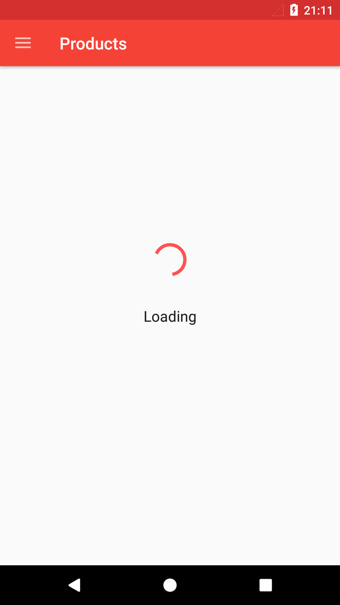
  
  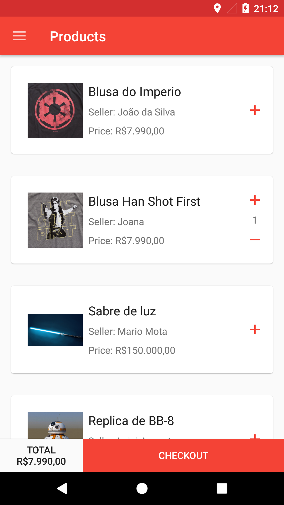
  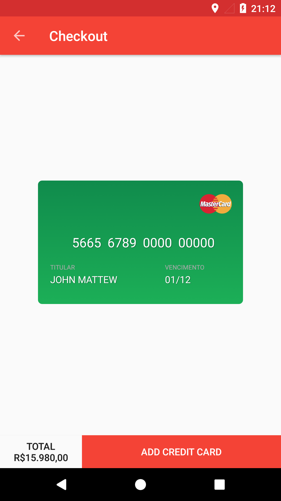
    
  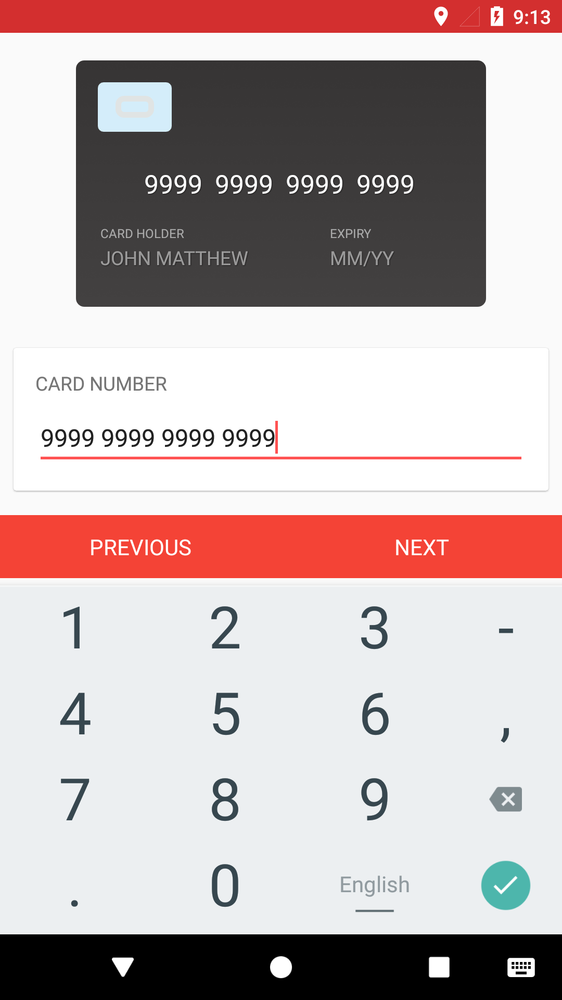
    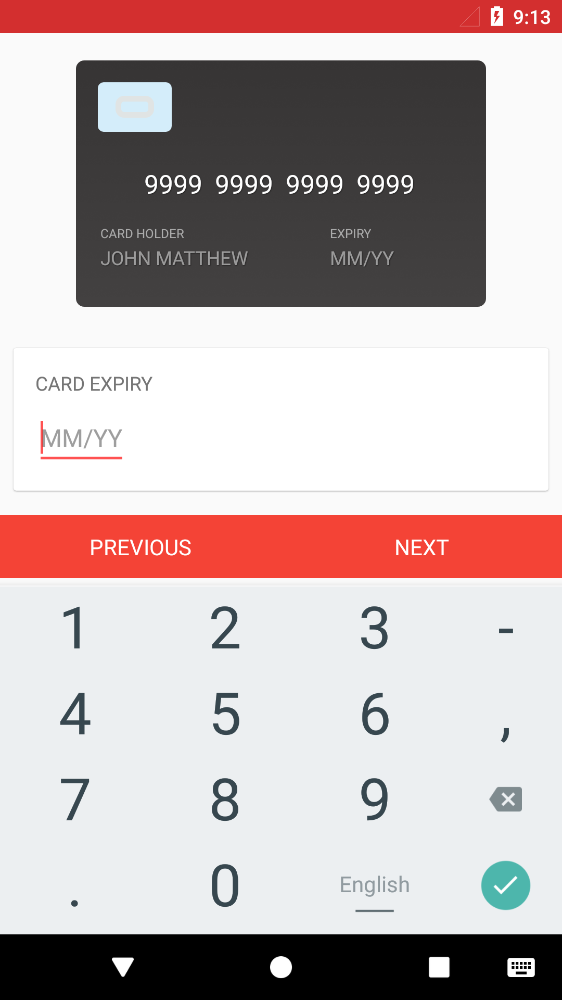
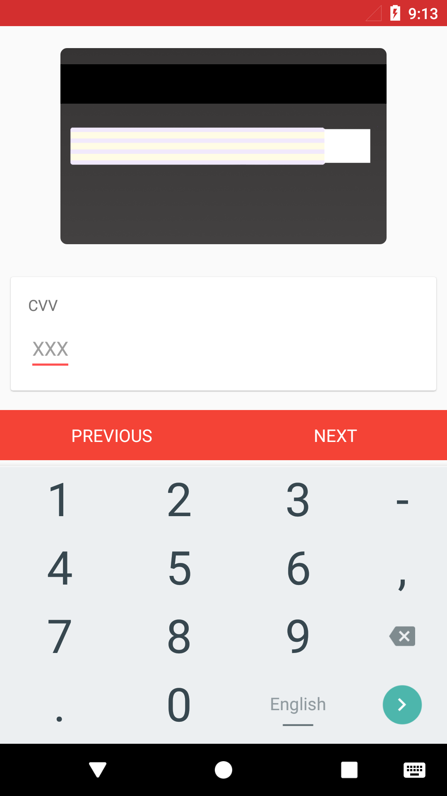
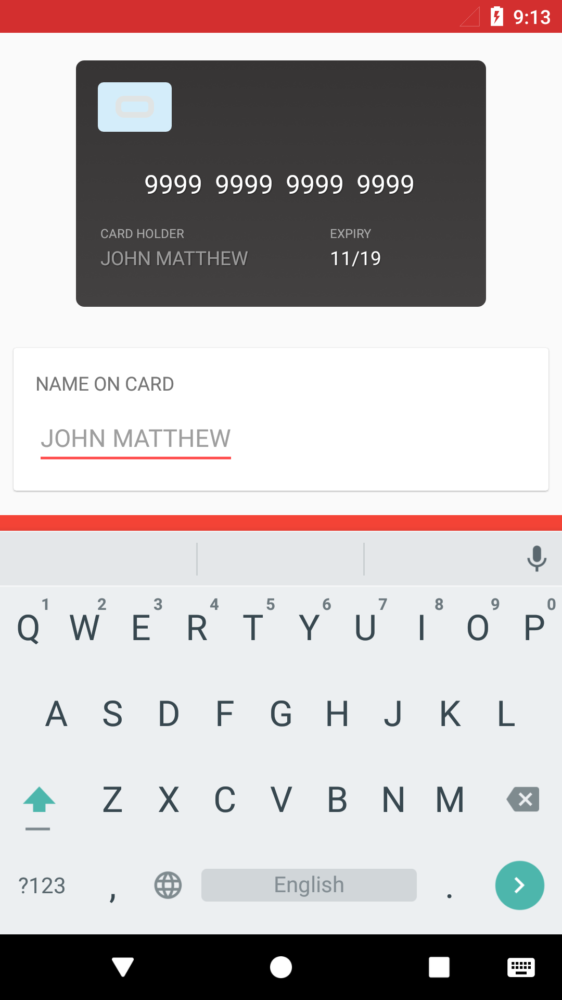
  

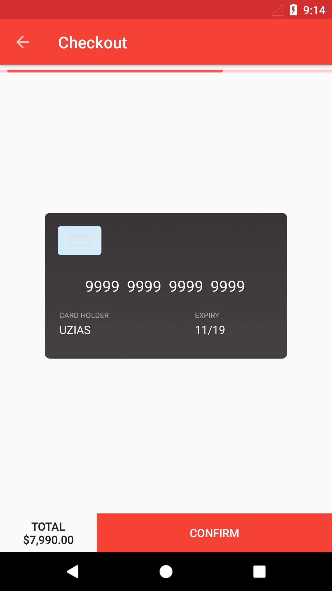
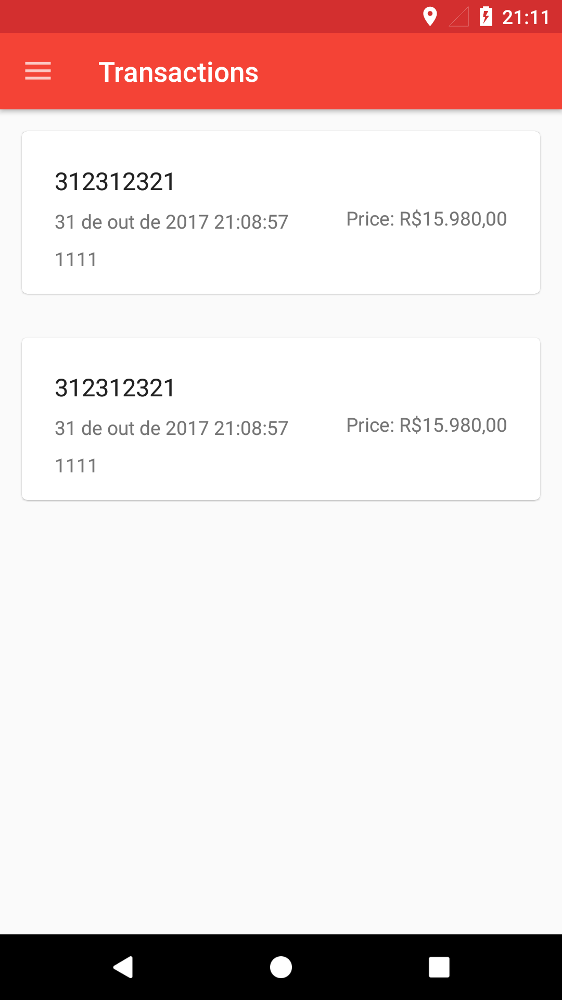
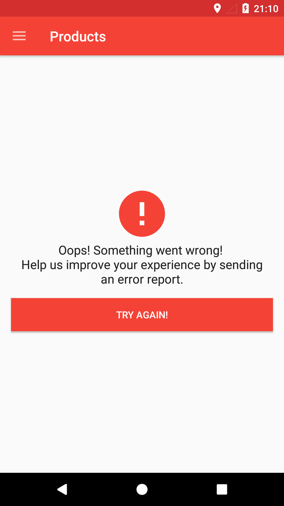
  

<a name="architecture" />

# Architecture

<a name="clean-architecture" />
-----------------

Architectural approach
-----------------

Architectural reactive approach
-----------------

<a name="design-patterns" />

## Design Patterns
 - **Singleton**: this pattern is used mainly to offer a single instance of presenters for their respective views. Its implementation happens thanks to Dagger2 @Singleton annotation;
 - **Observer**: this pattern is largely used in order to issue network events that trigger database actions or UI updates. The variant employed is observed based on bus, being all call routed to a class that holds reference to all subscribers;
 - **Delegate**: this pattern is used in more than one place in the Application, for instance, with Postman and Router classes. The idea is to decouple classes that play distinct roles in the app - as the ones responsible for network communication for instance. That way, if any maintenance is required on them it is not passed beyond the class that gather all calls;
 - **Factory**: the application uses Factory Pattern on default Dagger2 implementation as well as to acquire End Points references for instance;

 <a name="tests" />

 ## Quality Assurance

 

   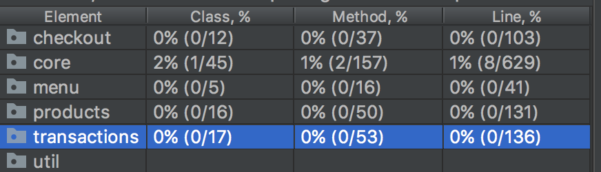
 

 One of the most importants gains that the Clean architecture pattern brings to the project is the fact that all business logic gets isolated on Presenter Layer, Domain layer, Data layer, it means, all code worthy to be tested is well encapsulated on classes with low dependency on OS components. This pattern alied with a Dependency Injection Container and Mock Frameworks (such as [Mockito](http://site.mockito.org/)  allows the developer to take full advantage of Unit Tests.   

<a name="frameworks" />

## Frameworks
 - [**Requery to database**](https://github.com/requery/requery/): _“(...) A light but powerful object mapping and SQL generator for Java/Kotlin/Android with RxJava and Java 8 support. Easily map to or create databases, perform queries and updates from any platform that uses Java.”_
 - [**Retrofit**](https://square.github.io/retrofit/): _"(...) A type-safe HTTP client for Android and Java;
     - [**OkHttp**](http://square.github.io/okhttp/): “(...) HTTP is the way modern applications network. It’s how we exchange data & media. Doing HTTP efficiently makes your stuff load faster and saves bandwidth.
       OkHttp is an HTTP client that’s efficient by default:
          - HTTP/2 support allows all requests to the same host to share a socket.
          - Connection pooling reduces request latency (if HTTP/2 isn’t available).
          - Transparent GZIP shrinks download sizes.
          - Response caching avoids the network completely for repeat requests.

        OkHttp perseveres when the network is troublesome: it will silently recover from common connection problems. If your service has multiple IP addresses OkHttp will attempt alternate addresses if the first connect fails. This is necessary for IPv4+IPv6 and for services hosted in redundant data centers. OkHttp initiates new connections with modern TLS features (SNI, ALPN), and falls back to TLS 1.0 if the handshake fails.
        Using OkHttp is easy. Its request/response API is designed with fluent builders and immutability. It supports both synchronous blocking calls and async calls with callbacks. OkHttp supports Android 2.3 and above. For Java, the minimum requirement is 1.7…”_ [**RxAndroid**](https://github.com/ReactiveX/RxAndroid): _“(...) ReactiveX is a combination of the best ideas from the Observer pattern, the Iterator pattern, and functional programming...”_
 - [**Dagger 2**](https://google.github.io/dagger/): a dependency Injector for Android and Java, used to grant one of the S.O.L.I.D. principles for OO programming (Dependency Inversion Principle). Besides allowing the high level class to not depend upon low level ones, it makes Unit Test easier to perform with the help of a mocking framework i.e. Mockito;
 - **Other**:
     - [**CreditCardView**](https://github.com/sharish/CreditCardView): _"(...) CreditCardView is a rich UX custom view to accomodate Credit Cards / Debit Cards while handling payment systems. The library consists of...."_
     -  [**Mockito-Kotlin**](https://github.com/nhaarman/mockito-kotlin): _"(...) A small library that provides helper functions to work with Mockito in Kotlin...."_

<a name="setup" />

# Application Setup
In order to make this application work, follow the steps below:

1. Have a Android Studio 3.0
1. Clone the repository to your local machine;
2. Build the project.

<a name="license" />

## License
Copyright 2017 Uzias Santos Ferreira

Licensed under the Apache License, Version 2.0 (the "License");
you may not use this file except in compliance with the License.
You may obtain a copy of the License at

    http://www.apache.org/licenses/LICENSE-2.0

Unless required by applicable law or agreed to in writing, software
distributed under the License is distributed on an "AS IS" BASIS,
WITHOUT WARRANTIES OR CONDITIONS OF ANY KIND, either express or implied.
See the License for the specific language governing permissions and
limitations under the License.
